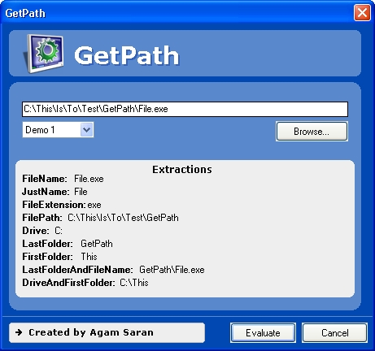



## GetPath

### Description

Do you use different functions to extract Filename, Filepath, or Extension from a path. GetPath is a function that can extract 9 different parts from a path. It can extract FileName, JustName, FileExtension, FilePath, Drive, LastFolder, FirstFolder, LastFolderAndFileName and DriveAndFirstFolder. It supports relative paths too. Try to parse "C:\Look\At\The\FileExtension\Of\This\Path.exe\" to your GetExtension function and then it to my GetPath function. Also try "C:\Temp\Is\A\File\Not\A\Folder\Temp". You will know the difference. I will feel glad to hear your comments and suggestions.
 
### More Info
 
Path, from what to extract, and PathType, what to extract

The desired extraction

             |
---                |---
**Submitted On**   |2007-01-21 08:10:02
**By**             |[Agam Saran](https://github.com/Planet-Source-Code/PSCIndex/blob/master/ByAuthor/agam-saran.md)
**Level**          |Intermediate
**User Rating**    |5.0 (15 globes from 3 users)
**Compatibility**  |VB 5\.0, VB 6\.0
**Category**       |[String Manipulation](https://github.com/Planet-Source-Code/PSCIndex/blob/master/ByCategory/string-manipulation__1-5.md)
**World**          |[Visual Basic](https://github.com/Planet-Source-Code/PSCIndex/blob/master/ByWorld/visual-basic.md)
**Archive File**   |[GetPath2043851212007\.zip](https://github.com/Planet-Source-Code/agam-saran-getpath__1-67695/archive/master.zip)

